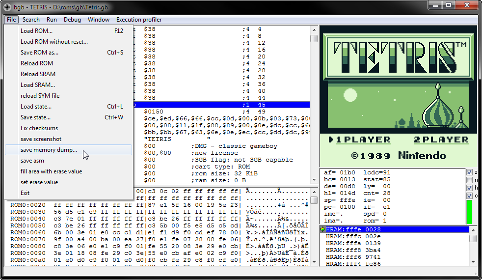
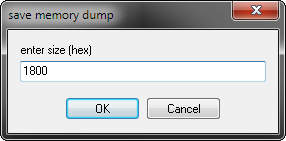
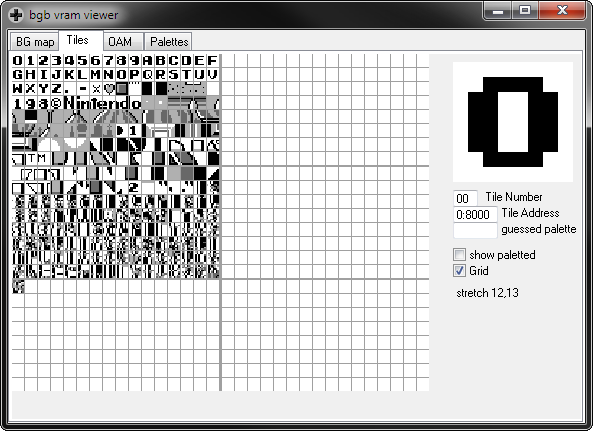

# Collecting and viewing VRAM dump using the BGB emulator
## Save a memory dump file
Launch [BGB](http://bgb.bircd.org/) and load a ROM, then go to File -> save memory dump...



Provide a start address of 8000 and length of 1800. This is where the tile data [lives in VRAM](http://gameboy.mongenel.com/dmg/asmmemmap.html):

 

## Run `gbromviewer` on the memory dump file

```
gbromviewer tetris.tileset.dump
```

This should produce an output image matching BGB's VRAM viewer (ignoring the palette):

*Tetris tileset viewed in BGB's VRAM viewer*

 

*Tetris tileset produced by gbromviewer (scaled 2x)*

")
